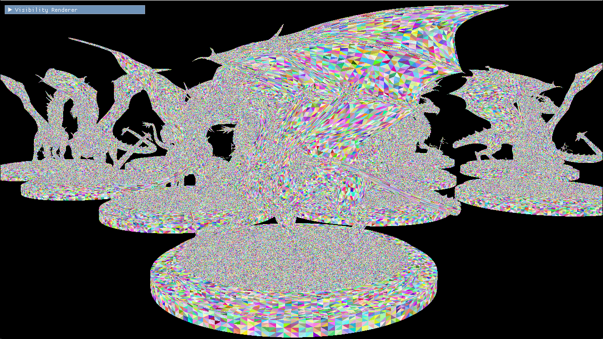
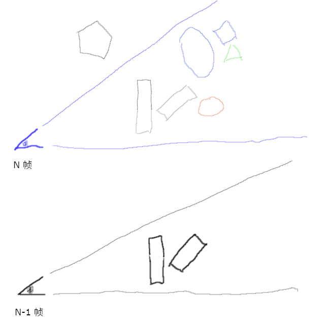
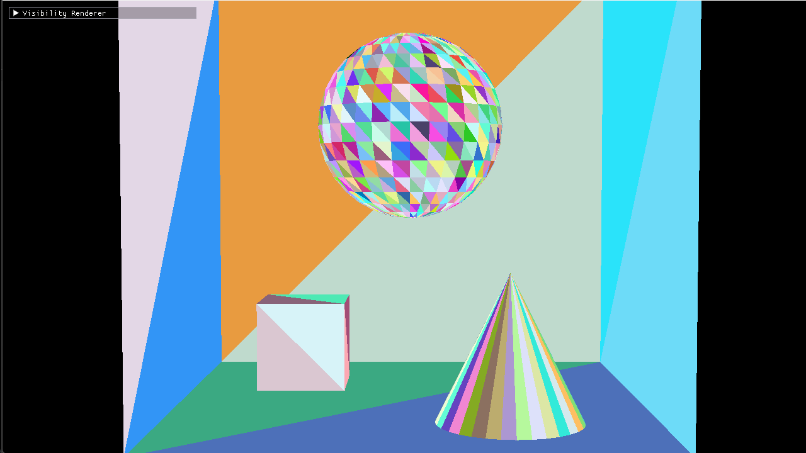
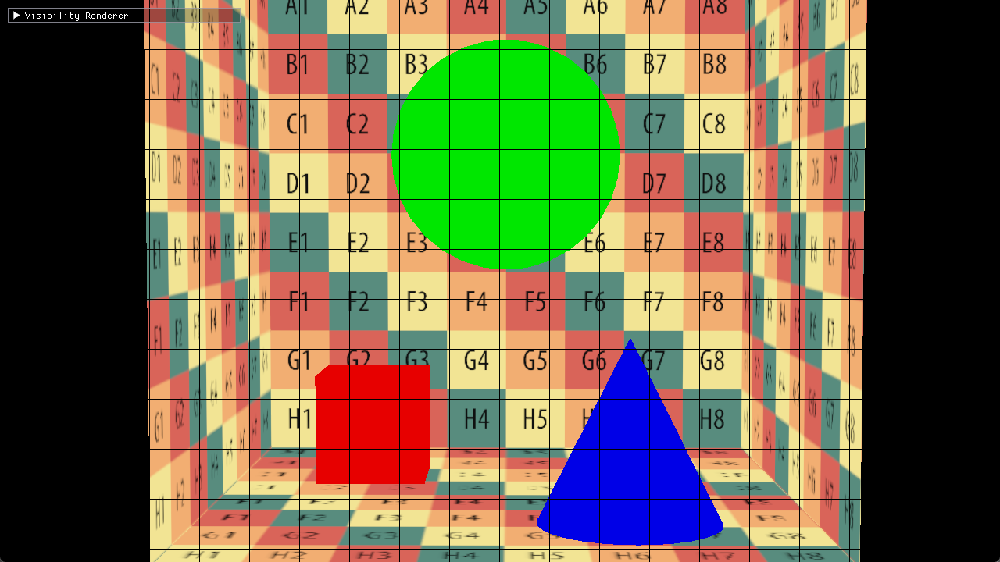
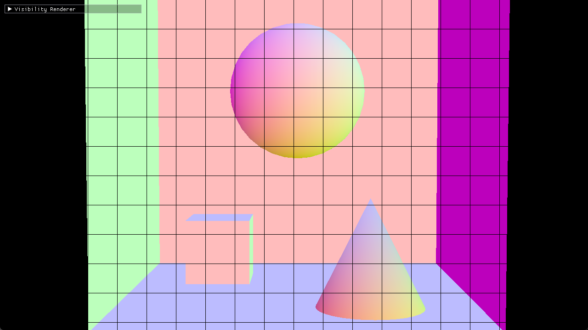
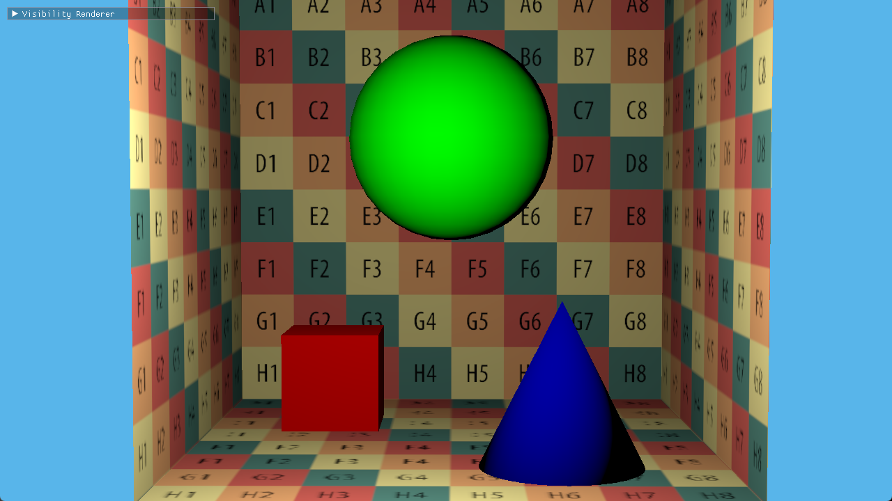

# hala-visibility-rendering
[](https://www.gnu.org/licenses/gpl-3.0.en.html)
[](https://blog.rust-lang.org/2023/06/01/Rust-1.70.0.html)

[English](README_EN.md) | [中文](README.md) | [日本語](README_JP.md) | [한국어](README_KO.md)

## 引言

Visibility Buffer的概念最早可以追溯到2013年，由Christopher A. Burns和Warren A. Hunt在他们的论文[The Visibility Buffer: A Cache-Friendly Approach to Deferred Shading](https://jcgt.org/published/0002/02/04/)中首次提出。自那时起，已经过去了十多年。这一技术因其在复杂场景下的高效，逐渐得到了业界的广泛关注和应用。

现如今，越来越多的游戏引擎和实际游戏项目开始将GPU Driven与Visibility Buffer技术相结合，以提升渲染性能和画面质量。这一结合使得现代图形渲染技术在处理场景复杂性和大规模数据时更加效率，有效地减少了CPU的负担，同时充分发挥了GPU的计算能力。本项目旨在从零开始实现最基础的Visibility Rendering，从GPU Culling开始，推动后续所有渲染步骤。



## 开发环境搭建

目前整个开发环境仅在Windows平台上使用RTX 4090测试通过（由于本人设备有限暂时无法测试更多的兼容性）。基于`hala-gfx`、`hala-renderer`和`hala-imgui`开发。

* `hala-gfx`负责Vulkan调用和封装。
* `hala-renderer`负责从glTF文件中读取Mesh信息并上传到GPU。
* `hala-imgui`是imGUI的Rust桥接，负责用户界面的显示和互动。

安装1.70+的Rust，如果已经安装`rustup update`为最新版本。使用`git clone --recursive`拉取仓库及其submodule。`cargo build`编译构建Debug版，或者`cargo build -r`构建Release版。

完成编译后可以直接运行。

    ./target/（debug或release）/hala-vis-renderer -c conf/config.toml

## 渲染流程

**注意：以下所有代码均为代码片段不可直接运行。另外为了解释方便很多Shader代码都做了部分“伪代码”化，不可直接编译。**

具体源码请参看GitHub仓库：[hala-visibility-rendering](https://github.com/zhing2006/hala-visibility-rendering)。

### 数据准备

为了高效的使用GPU Driven进行渲染，首先将所有的几何数据（Mesh）通过[meshopt](https://crates.io/crates/meshopt) crate转化为Meshlet。

以下为处理单个Mesh的代码片段。
```rust
  let vertex_data_adapter = unsafe {
    meshopt::VertexDataAdapter::new(
      std::slice::from_raw_parts(vertices.as_ptr() as *const u8, vertices.len() * std::mem::size_of::<HalaVertex>()),
      std::mem::size_of::<HalaVertex>(),
      0,
    ).map_err(|err| HalaRendererError::new("Failed to create vertex data adapter.", Some(Box::new(err))))?
  };
  let meshlets = meshopt::clusterize::build_meshlets(
    indices.as_slice(),
    &vertex_data_adapter,
    64,   // 单个Meshlet最大顶点数
    124,  // 单个Meshlet最大三角形数
    0.5,  // Cone weight，主要影响背面剔除的效率
  );
  for (meshlet_index, meshlet) in meshlets.meshlets.iter().enumerate() {
    let wrapped_meshlet = meshlets.get(meshlet_index);
    let bounds = meshopt::clusterize::compute_meshlet_bounds(
      wrapped_meshlet,
      &vertex_data_adapter,
    );

    let hala_meshlet = HalaMeshlet {
      center: bounds.center,
      radius: bounds.radius,
      cone_apex: bounds.cone_apex,
      cone_axis: bounds.cone_axis,
      cone_cutoff: bounds.cone_cutoff,
      offset_of_vertices: meshlet_vertices.len() as u32,
      num_of_vertices: meshlet.vertex_count,
      offset_of_primitives: meshlet_primitives.len() as u32,
      num_of_primitives: (wrapped_meshlet.triangles.len() / 3) as u32,
      draw_index, // 保存此Meshlet的Draw Index，此处为简化操作。生产环境需要使用CPU排序后真正的Meshlet渲染队列的索引
    };

    for i in wrapped_meshlet.vertices.iter() {
      meshlet_vertices.push(*i);
    }
    for c in wrapped_meshlet.triangles.chunks(3) {
      // 由于Meshlet最大顶点数为64，每个三角形的顶点索引使用8位保存绰绰有余
      meshlet_primitives.push((c[0] as u32) | (c[1] as u32) << 8 | (c[2] as u32) << 16);
    }
  }
```

还记得上面提到的`draw_index`吗？接下来就是准备其用来索引的DrawData数据。

```rust
struct DrawData {
  pub object_index: u32,
  pub material_index: u32,
}

draw_data.push(DrawData {
  object_index: mesh.index,
  material_index: prim.material_index,
});
```
object_index用于索引Object的相关信息，比如Transform等。material_index用于索引此draw用到的材质信息用于Alpha Test和着色。

绑定整个场景的Camera数据、Light数据、DrawData数据和Meshlet数据
```rust
hala_gfx::HalaDescriptorSetLayout::new(
  Rc::clone(&logical_device),
  &[
    // 全局uniform buffer，保存全局信息，比如vp矩阵，逆vp矩阵等。
    hala_gfx::HalaDescriptorSetLayoutBinding {
      binding_index: 0,
      descriptor_type: hala_gfx::HalaDescriptorType::UNIFORM_BUFFER,
      ...
    },
    // 相机uniform buffer，保存场景中的相机信息，比如每个相机的位置等。
    hala_gfx::HalaDescriptorSetLayoutBinding {
      binding_index: 1,
      descriptor_type: hala_gfx::HalaDescriptorType::UNIFORM_BUFFER,
      ...
    },
    // 灯光uniform buffer，保存场景中的灯光信息，比如每个灯光的位置等。
    hala_gfx::HalaDescriptorSetLayoutBinding {
      binding_index: 2,
      descriptor_type: hala_gfx::HalaDescriptorType::UNIFORM_BUFFER,
      ...
    },
    // 上面提到的DrawData信息的storage buffer。
    hala_gfx::HalaDescriptorSetLayoutBinding {
      binding_index: 3,
      descriptor_type: hala_gfx::HalaDescriptorType::STORAGE_BUFFER,
      ...
    },
    // Meshlet信息的storage buffer。
    hala_gfx::HalaDescriptorSetLayoutBinding {
      binding_index: 4,
      descriptor_type: hala_gfx::HalaDescriptorType::STORAGE_BUFFER,
      ...
    },
  ],
  "main_static.descriptor_set_layout",
)?,
```

采用Bindless绑定Material数据、Object数据、Mesh数据和Meshlet数据。
```rust
hala_gfx::HalaDescriptorSetLayout::new(
  Rc::clone(&logical_device),
  &[
    // 保存Material信息的uniform buffer数组。
    hala_gfx::HalaDescriptorSetLayoutBinding {
      binding_index: 0,
      descriptor_type: hala_gfx::HalaDescriptorType::UNIFORM_BUFFER,
      descriptor_count: scene.materials.len() as u32,
      ...
    },
    // 保存Object信息的uniform buffer数组。
    hala_gfx::HalaDescriptorSetLayoutBinding {
      binding_index: 1,
      descriptor_type: hala_gfx::HalaDescriptorType::UNIFORM_BUFFER,
      descriptor_count: scene.meshes.len() as u32,
      ...
    },
    // 每个Mesh的顶点信息，storage buffer数组。
    hala_gfx::HalaDescriptorSetLayoutBinding {
      binding_index: 2,
      descriptor_type: hala_gfx::HalaDescriptorType::STORAGE_BUFFER,
      descriptor_count: vertex_buffers.len() as u32,
      ...
    },
    // 每个Meshlet的顶点信息，storage buffer数组。
    hala_gfx::HalaDescriptorSetLayoutBinding {
      binding_index: 5,
      descriptor_type: hala_gfx::HalaDescriptorType::STORAGE_BUFFER,
      descriptor_count: meshlet_vertex_buffers.len() as u32,
      ...
    },
    // 每个Meshlet的三角形信息，storage buffer数组。
    hala_gfx::HalaDescriptorSetLayoutBinding {
      binding_index: 6,
      descriptor_type: hala_gfx::HalaDescriptorType::STORAGE_BUFFER,
      descriptor_count: meshlet_primitive_buffers.len() as u32,
      ...
    },
  ],
  "main_dynamic.descriptor_set_layout",
)?,
```

最后是采用Bindless绑定Texture数据。
```rust
  hala_gfx::HalaDescriptorSetLayout::new(
    Rc::clone(&logical_device),
    &[
      // 所有贴图的Image数组。
      hala_gfx::HalaDescriptorSetLayoutBinding {
        binding_index: 0,
        descriptor_type: hala_gfx::HalaDescriptorType::SAMPLED_IMAGE,
        descriptor_count: scene.textures.len() as u32,
        ...
      },
      // 所有贴图采样器的Sampler数组。
      hala_gfx::HalaDescriptorSetLayoutBinding { // All samplers in the scene.
        binding_index: 1,
        descriptor_type: hala_gfx::HalaDescriptorType::SAMPLER,
        descriptor_count: scene.textures.len() as u32,
        ...
      },
    ],
    "textures.descriptor_set_layout",
  )?,
```

至此所有数据都准备就绪，接下来就是开始GPU渲染。我们使用一次TaskDraw绘制整个场景。
```rust
// 每个Task线程组有32个线程。
let dispatch_size_x = (scene.meshlet_count + 32 - 1) / 32;
graphics_command_buffers.draw_mesh_tasks(
  index,
  dispatch_size_x,
  1,
  1,
);
```

### GPU裁剪

首先需要进行背面裁剪和视锥裁剪。这里就需要用到之前计算Meshlet时产生的Cone和Sphere数据。
```rust
  // 背面裁剪。
  const float3 cone_apex = mul(per_object_data.m_mtx, float4(meshlet.cone_apex, 1.0)).xyz;
  const float3 cone_axis = normalize(mul(float4(meshlet.cone_axis, 0.0), per_object_data.i_m_mtx).xyz);
  if (dot(normalize(cone_apex - camera_position), cone_axis) >= meshlet.cone_cutoff) {
    is_visible = false;
  }

  if (is_visible) {
    // 视锥裁剪，由于Object有非等比缩放所以这里不直接使用Bound Sphere裁剪而是转换为Bound Box后进行。
    const float3 bound_box_min = mul(per_object_data.m_mtx, float4(meshlet.bound_sphere.xyz - meshlet.bound_sphere.w, 1.0)).xyz;
    const float3 bound_box_max = mul(per_object_data.m_mtx, float4(meshlet.bound_sphere.xyz + meshlet.bound_sphere.w, 1.0)).xyz;
    if (is_box_frustum_culled(bound_box_min, bound_box_max)) {
      is_visible = false;
    }
  }
```

接下来就是进行遮挡剔除，这里使用2-Phase Occlusion Culling。



假设当前帧（N 帧）之前有一帧灰色标记的前一帧（N-1 帧），在N-1 帧中绘制了两个盒子。这个深度缓冲将延续到N 帧中使用。

在N 帧中，首先完成视锥剔除和背面剔除。在这一步中，视野范围外的五边形被剔除。

接下来，由于使用前一帧的深度缓冲，蓝色的椭圆和方形将被渲染。椭圆形无所谓，但遮挡在它后面的方形也会被渲染。这种状况下本应不被渲染的物体被渲染称为False Positive（假阳性）。不过，如果在下一帧中摄像机没有大幅移动，False Positive一般不会持续很久。

橙色的球体和淡绿色的三角形在第一阶段被前一帧的深度缓冲剔除。所有在第一阶段被遮挡剔除的物体都会标记为False Negative，因此暂时不进行渲染。

在第二阶段剔除之前，第一阶段未被剔除的椭圆和方形会被绘制到深度缓冲。第二阶段则使用这个深度缓冲执行剔除。第一阶段被剔除的橙色球体在此深度缓冲下未被剔除，因此会绘制出来，证明了它是False Negative。然而，淡绿色的三角形这次还是被椭圆遮挡，证明它不是False Negative，而确实应该被剔除。

具体实现见如下代码。

Pass One
```HLSL
float3 aabb_min_screen, aabb_max_screen;
// 计算屏幕空间的AABB，如果Box与相机前裁剪面相交to_screen_aabb返回true不需要进行遮挡剔除。
if (!to_screen_aabb(g_global_uniform.vp_mtx, bound_box_min, bound_box_max, aabb_min_screen, aabb_max_screen)) {
  // 如果被遮挡，则记录遮挡和可见信息。
  if (is_occluded(in_hiz_image, g_push_constants.hiz_levels, g_push_constants.hiz_size, aabb_min_screen, aabb_max_screen)) {
    is_occluded_by_hiz = true;
    is_visible = false;
  }
}

// 如果可见（真阳性），没有被遮挡（假阳性）则此Pass已渲染标记为1，Pass Two只处理标记为0的Meshlet。
out_culling_flags.Store(meshlet_index * 4, (is_visible || !is_occluded_by_hiz) ? 1 : 0);
```

Pass Two
```HLSL
const uint culling_flag = in_culling_flags.Load(meshlet_index * 4);
// 如果Pass One没有渲染此Meshlet，则开始进行遮挡剔除判断。
if (culling_flag == 0) {
  const float3 bound_box_min = mul(per_object_data.m_mtx, float4(meshlet.bound_sphere.xyz - meshlet.bound_sphere.w, 1.0)).xyz;
  const float3 bound_box_max = mul(per_object_data.m_mtx, float4(meshlet.bound_sphere.xyz + meshlet.bound_sphere.w, 1.0)).xyz;

  // 同前一阶段，不再做解释。
  float3 aabb_min_screen, aabb_max_screen;
  if (!to_screen_aabb(g_global_uniform.vp_mtx, bound_box_min, bound_box_max, aabb_min_screen, aabb_max_screen)) {
    if (is_occluded(in_hiz_image, g_push_constants.hiz_levels, g_push_constants.hiz_size, aabb_min_screen, aabb_max_screen)) {
      is_visible = false;
    } else {
      is_visible = true;
    }
  }
}

Pass One和Pass Two都是用Wave函数进行统计可见Meshlet数量，然后发起对应数量的Mesh Shader调用。
```HLSL
if (is_visible) {
  const uint index = WavePrefixCountBits(is_visible);
  ms_payload.meshlet_indices[index] = meshlet_index;
}

// 一个Meshlet发起一个Mesh Shader Group。
const uint visible_count = WaveActiveCountBits(is_visible);
DispatchMesh(visible_count, 1, 1);
```

该方法的主要优点是不需要区分Occluder和Occludee。前一帧的深度缓冲直接作为Occluder，所有本帧要渲染的对象都作为Occludee处理。因此，不再需要简易的Occluder专用网格。

此外，在第二阶段处理完之后，不会再存在本应被渲染却因剔除而消失的物体（假阴性），也就是常见于UE4的物体短暂消失的现象将完全消除。

然而，也会存在本应被剔除却没有被剔除的物体（假阳性）。无论是在CPU还是GPU处理，只要用包围盒进行遮挡检查，就无法避免假阳性。然而，在这个方法中，即使包围盒完全被遮挡，仍可能存在假阳性。不过，正如前述，被假阳性渲染的物体并不容易在连续帧中多次出现。例如上图中，如果N+1帧与N帧的摄像机位置相同，前一帧的深度缓冲已经渲染了椭圆，方形在两阶段中都会被遮挡，因而不会被绘制。

尽管这个方法有许多优点，但也有缺点，那就是剔除处理会进行两次。视锥剔除和背面剔除只进行一次，但较为耗时的遮挡剔除最多要进行两次，负担不可小觑。

当用深度缓冲进行剔除时，使用全分辨率深度缓存会增加负担，因此需要生成分层深度（HiZ）。而且，这需要在每个阶段完成后进行，全场景需要进行两次。由于深度缓冲从写入到读取的状态切换时，会伴随深度缓冲的解压缩和缓存刷新，因此计算量不容忽视。

### 渲染Visibility ID

使用Mesh Shader后，渲染Visibility ID相对简单，只需要写入SV_PrimitiveID数据即可。

```HLSL
struct ToFragmentPrimitive {
  uint primitive_id: SV_PrimitiveID;
};

primitives[triangle_id].primitive_id = pack_meshlet_triangle_index(meshlet_index, triangle_id);
```

由于我们的Meshlet做多124个三角形，因此triangle_id只需要7位，meshlet_index可以存储25位。打包和解包Visibility ID函数如下。

```HLSL
uint pack_meshlet_triangle_index(uint meshlet_index, uint triangle_index) {
  return ((meshlet_index & 0x1FFFFFF) << 7) | (triangle_index & 0x7F);
}

void unpack_meshlet_triangle_index(uint packed_index, out uint meshlet_index, out uint triangle_index) {
  meshlet_index = (packed_index & 0xFFFFFF80) >> 7;
  triangle_index = packed_index & 0x7F;
}
```

最终Visibility Buffer内容如下


### 材质分类排序

为了接下里的绘制，这里需要为每种类型的材质生成IndirectDraw参数，并按64x64的Tile大小进行绘制。

这里使用UE5的方法，首先将不同的材质类型写入Depth Buffer中。

```HLSL
const uint vis_id = in_vis_buffer[screen_xy];
uint meshlet_index, triangle_id;
unpack_meshlet_triangle_index(vis_id, meshlet_index, triangle_id);

const Meshlet meshlet = g_global_meshlets[meshlet_index];
const DrawData draw_data = g_draw_data[meshlet.draw_index];
output.depth = (float)draw_data.material_index / (float)CLASSIFY_DEPTH_RANGE;
```

CLASSIFY_DEPTH_RANGE是一个常量，足以容纳场景中所有的材质类型。

接下来就是利用Compute Shader对材质进行分类了，先看一下分类函数。

```HLSL
// CLASSIFY_DEPTH_RANGE = CLASSIFY_NUM_OF_MATERIALS_PER_GROUP * 32
// 一个uint为32位，所以这里需要长度为CLASSIFY_NUM_OF_MATERIALS_PER_GROUP的组内共享内存保存材质信息。
groupshared uint gs_material_flag[CLASSIFY_NUM_OF_MATERIALS_PER_GROUP];

void classify_pixel(in uint2 pos) {
  if (all(lessThan(pos, g_push_constants.screen_size))) {
    const float depth = in_depth_buffer.Load(pos, 0);

    // 此像素有效，不在无限远（背景）上。
    if (depth > 0.0) {
      const uint vis_id = in_vis_buffer.Load(pos, 0);
      uint meshlet_index, triangle_id;
      unpack_meshlet_triangle_index(id, meshlet_index, triangle_id);

      const Meshlet meshlet = g_global_meshlets[meshlet_index];
      const DrawData draw_data = g_draw_data[meshlet.draw_index];
      const uint material_index = draw_data.material_index;
      const uint index = draw_data.material_index / 32;
      const uint bit = draw_data.material_index % 32;
      uint orig;
      // 将此位置的材质类型标记到组内共享内存上。
      InterlockedOr(gs_material_flag[index], 0x1u << bit, orig);
    }
  }
}
```

整个分类流程如下。

```HLSL
[numthreads(CLASSIFY_THREAD_WIDTH, CLASSIFY_THREAD_WIDTH, 1)]
void main(
  uint3 group_id : SV_GroupID,
  uint3 group_thread_id : SV_GroupThreadID,
  uint3 dispatch_thread_id : SV_DispatchThreadID)
{
  // 初始化组内共享内存。
  const uint mat_chunk_index = group_thread_id.y * CLASSIFY_THREAD_WIDTH + group_thread_id.x;
  gs_material_flag[mat_chunk_index] = 0x0;

  // 组内同步。
  GroupMemoryBarrierWithGroupSync();

  // 对64x64范围内的像素进行材质分类。
  const uint2 base_pos = group_id.xy * CLASSIFY_TILE_WIDTH + group_thread_id.xy;
  for (uint x = 0; x < 4; x++) {
    for (uint y = 0; y < 4; y++) {
      classify_pixel(base_pos + uint2(x, y) * CLASSIFY_THREAD_WIDTH);
    }
  }

  // 组内同步。
  GroupMemoryBarrierWithGroupSync();

  // 读取分类信息，并生成IndirectDraw数据。
  uint bits = gs_material_flag[mat_chunk_index];
  if (bits != 0) {
    const uint mat_base_index = mat_chunk_index * 32;
    while (bits != 0) {
      const uint first_bit = firstbitlow(bits);
      const uint mat_index = mat_base_index + first_bit;
      bits &= ~(0x1u << first_bit);

      // 一个IndirectDrawArgs大小为16字节（vertex_count，instance_count，first_vertex，first_instance）。
      const uint arg_addr = mat_index * 16;
      uint store_addr = 0;
      // 对instance_count字段加1，标记此64x64的Tile需要绘制。
      InterlockedAdd(out_indirect_draw_arguments, arg_addr + 4, 1, store_addr);

      // 记录此Tile的Index，方便后面绘制时生成对应的四边形绘制此Tile。
      const uint tile_no = group_id.y * g_push_constants.x_size + group_id.x;
      store_addr = ((mat_index * g_push_constants.num_of_tiles) + store_addr) * 4;
      out_tile_index.Store(store_addr, tile_no);
    }
  }
}
```

有了以上Material Depth，就可以针对每种类型的材质调用IndirectDraw绘制了，此时使用Z-Test Equal只绘制材质覆盖的像素。

```rust
for material_index in 0..num_of_materials {
  graphics_command_buffers.draw_indirect(
    index,
    self.indirect_draw_buffer.as_ref(),
    material_index as u64 * std::mem::size_of::<hala_gfx::HalaIndirectDrawCommand>() as u64,
    1,
    std::mem::size_of::<hala_gfx::HalaIndirectDrawCommand>() as u32,
  );
}
```

这里为了简化，直接使用了材质数量当作了材质类型，实际使用时，应使用材质类型。

### 渲染GBuffer

虽然在Visibility Rendering中，GBuffer不是必须的，但考虑到现在的游戏渲染越来越复杂，为避免重复获取三角形几何数据和材质数据，特别是Visibility Rendering中必须手动计算偏导数，因此这里仍然进行GBuffer渲染将Geometry阶段和Lighting阶段分离。

首先需要从Visibility Buffer中还原几何信息。

```HLSL
// 通过Meshlet数据获取三角形三个顶点的索引。
uint3 load_primitive_index(uint index, uint draw_index) {
  const uint primitive_index = g_unique_primitives[draw_index].Load(index * 4);

  const uint triangle_index0 = (primitive_index & 0xFF);
  const uint triangle_index1 = (primitive_index & 0xFF00) >> 8;
  const uint triangle_index2 = (primitive_index & 0xFF0000) >> 16;
  return uint3(triangle_index0, triangle_index1, triangle_index2);
}

const uint vis_id = in_vis_buffer[screen_xy];
uint meshlet_index, triangle_id;
unpack_meshlet_triangle_index(vis_id, meshlet_index, triangle_id);

const Meshlet meshlet = g_global_meshlets[meshlet_index];
uint triangle_index = meshlet.offset_of_primitives + triangle_id;
const uint3 tri = load_primitive_index(triangle_index, meshlet.draw_index);
```

计算质心和偏导数时使用 http://filmicworlds.com/blog/visibility-buffer-rendering-with-material-graphs/ 的方法。
```HLSL
struct BaryDeriv {
  float3 lambda;
  float3 ddx;
  float3 ddy;
};

BaryDeriv calc_full_bary(float4 pt0, float4 pt1, float4 pt2, float2 pixel_ndc, float2 win_size) {
  BaryDeriv ret = (BaryDeriv)0;

  const float3 inv_w = rcp(float3(pt0.w, pt1.w, pt2.w));

  const float2 ndc0 = pt0.xy * inv_w.x;
  const float2 ndc1 = pt1.xy * inv_w.y;
  const float2 ndc2 = pt2.xy * inv_w.z;

  const float inv_det = rcp(determinant(float2x2(ndc2 - ndc1, ndc0 - ndc1)));
  ret.ddx = float3(ndc1.y - ndc2.y, ndc2.y - ndc0.y, ndc0.y - ndc1.y) * inv_det * inv_w;
  ret.ddy = float3(ndc2.x - ndc1.x, ndc0.x - ndc2.x, ndc1.x - ndc0.x) * inv_det * inv_w;
  float ddx_sum = dot(ret.ddx, float3(1, 1, 1));
  float ddy_sum = dot(ret.ddy, float3(1, 1, 1));

  const float2 delta_vec = pixel_ndc - ndc0;
  const float interp_inv_w = inv_w.x + delta_vec.x * ddx_sum + delta_vec.y * ddy_sum;
  const float interp_w = rcp(interp_inv_w);

  ret.lambda.x = interp_w * (inv_w[0] + delta_vec.x * ret.ddx.x + delta_vec.y * ret.ddy.x);
  ret.lambda.y = interp_w * (0.0      + delta_vec.x * ret.ddx.y + delta_vec.y * ret.ddy.y);
  ret.lambda.z = interp_w * (0.0      + delta_vec.x * ret.ddx.z + delta_vec.y * ret.ddy.z);

  ret.ddx *= (2.0 / win_size.x);
  ret.ddy *= (2.0 / win_size.y);
  ddx_sum *= (2.0 / win_size.x);
  ddy_sum *= (2.0 / win_size.y);

  ret.ddy *= -1.0;
  ddy_sum *= -1.0;

  const float interp_w_ddx = 1.0 / (interp_inv_w + ddx_sum);
  const float interp_w_ddy = 1.0 / (interp_inv_w + ddy_sum);

  ret.ddx = interp_w_ddx * (ret.lambda * interp_inv_w + ret.ddx) - ret.lambda;
  ret.ddy = interp_w_ddy * (ret.lambda * interp_inv_w + ret.ddy) - ret.lambda;

  return ret;
}

float3 interpolate_with_deriv(BaryDeriv deriv, float v0, float v1, float v2) {
  const float3 merged_v = float3(v0, v1, v2);
  float3 ret;
  ret.x = dot(merged_v, deriv.lambda);
  ret.y = dot(merged_v, deriv.ddx);
  ret.z = dot(merged_v, deriv.ddy);
  return ret;
}
```

具体顶点数据的获取比较冗长，这里就略过了，只列出获取后的顶点数据。

```HLSL
struct VertexAttributes {
  float3 position;
  float3 position_ddx;
  float3 position_ddy;
  float3 normal;
  float3 tangent;
  float2 texcoord;
  float2 texcoord_ddx;
  float2 texcoord_ddy;
};
```

最后就是写入GBuffer了。

```HLSL
if (mtrl.base_color_map_index != INVALID_INDEX) {
  float3 base_color = SAMPLE_TEXTURE_GRAD(
    g_textures[mtrl.base_color_map_index],
    g_samplers[mtrl.base_color_map_index],
    vertex_attributes.texcoord,
    vertex_attributes.texcoord_ddx,
    vertex_attributes.texcoord_ddy
  ).rgb;
  output.albedo = float4(base_color, 1.0);
} else {
  output.albedo = float4(mtrl.base_color, 1.0);
}

output.normal = float4(vertex_attributes.normal * 0.5 + 0.5, 1.0);
```

至此，我们已经获得了完整的GBuffer数据。





### 照亮世界

其实到了这一步没有什么好讲的啦。我们已经有了Albedo、Normal和Depth，剩下的就是在世界空间中还原各种属性计算光照了BRDF了。相关的介绍文章已经很多了，这里就不再重复了。

