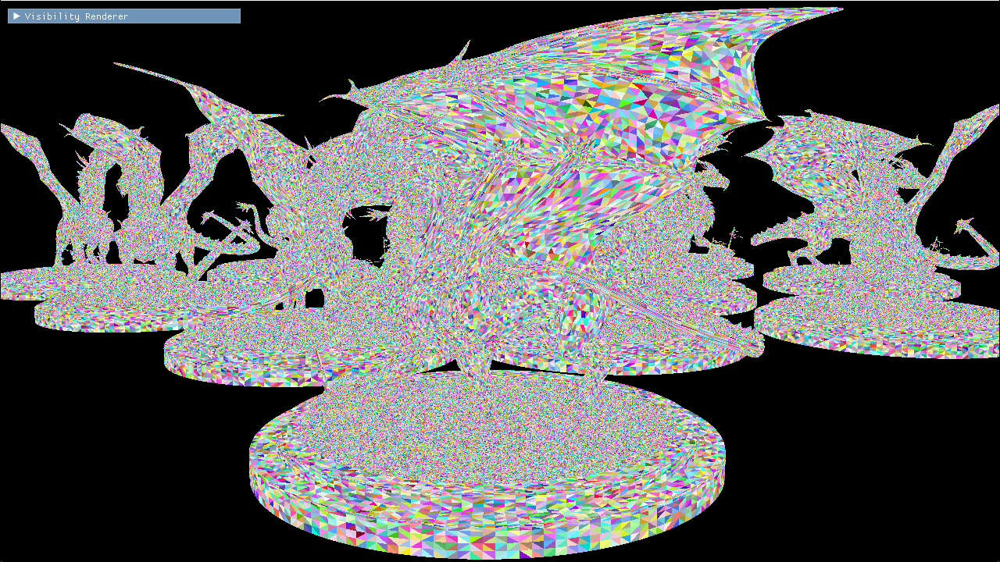
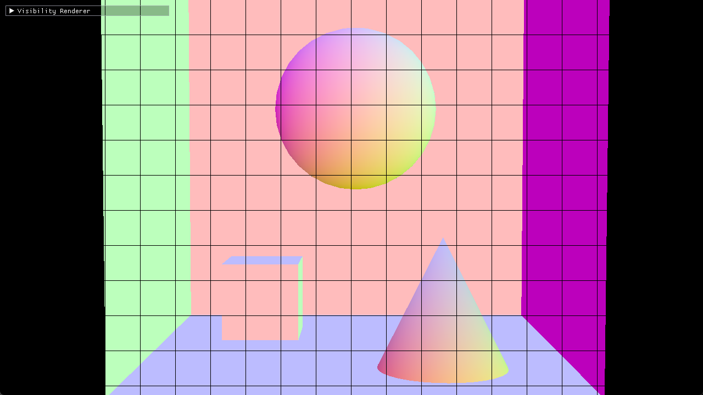

# hala-visibility-rendering
[](https://www.gnu.org/licenses/gpl-3.0.en.html)
[](https://blog.rust-lang.org/2023/06/01/Rust-1.70.0.html)

[English](README.md) | [中文](README_CN.md) | [日本語](README_JP.md) | [한국어](README_KO.md)

## 引言

Visibility Bufferの概念は2013年に遡り、Christopher A. BurnsとWarren A. Huntが彼らの論文[The Visibility Buffer: A Cache-Friendly Approach to Deferred Shading](https://jcgt.org/published/0002/02/04/)で初めて提案しました。それ以来、10年以上が経過しました。この技術は複雑なシーンでの効率性のため、業界で広く注目され、応用されています。

現在、ますます多くのゲームエンジンや実際のゲームプロジェクトがGPU DrivenとVisibility Buffer技術を組み合わせて、レンダリング性能と画質を向上させています。この組み合わせにより、現代のグラフィックレンダリング技術はシーンの複雑性や大規模データを処理する際により効率的になり、CPUの負担を効果的に減少させると同時に、GPUの計算能力を最大限に活用します。本プロジェクトは、GPU Cullingから始めて、最も基本的なVisibility Renderingをゼロから実装し、後続のすべてのレンダリングステップを推進することを目的としています。



## 開発環境の構築

現在、開発環境はWindowsプラットフォーム上でRTX 4090を使用してテストされています（私のデバイスの制限により、他の互換性をテストすることはできません）。`hala-gfx`、`hala-renderer`、および`hala-imgui`を基に開発されています。

* `hala-gfx`はVulkanの呼び出しとラッピングを担当します。
* `hala-renderer`はglTFファイルからMesh情報を読み取り、GPUにアップロードします。
* `hala-imgui`はimGUIのRustブリッジで、ユーザーインターフェースの表示とインタラクションを担当します。

Rustのバージョン1.70+をインストールし、すでにインストールされている場合は`rustup update`で最新バージョンに更新します。`git clone --recursive`を使用してリポジトリとそのサブモジュールをクローンします。`cargo build`でデバッグ版をコンパイルし、または`cargo build -r`でリリース版をコンパイルします。

コンパイルが完了したら、直接実行できます。

    ./target/（debugまたはrelease）/hala-vis-renderer -c conf/config.toml

## レンダリングプロセス

**注意：以下のすべてのコードはコードスニペットであり、直接実行することはできません。また、説明を容易にするために、多くのシェーダーコードは部分的に「擬似コード化」されており、直接コンパイルすることはできません。**

具体的なソースコードはGitHubリポジトリ：[hala-visibility-rendering](https://github.com/zhing2006/hala-visibility-rendering)をご覧ください。

### データ準備

GPU Drivenを効率的に使用するために、まずすべてのジオメトリデータ（Mesh）を[meshopt](https://crates.io/crates/meshopt)クレートを使用してMeshletに変換します。

以下は単一のMeshを処理するコードスニペットです。
```rust
  let vertex_data_adapter = unsafe {
    meshopt::VertexDataAdapter::new(
      std::slice::from_raw_parts(vertices.as_ptr() as *const u8, vertices.len() * std::mem::size_of::<HalaVertex>()),
      std::mem::size_of::<HalaVertex>(),
      0,
    ).map_err(|err| HalaRendererError::new("Failed to create vertex data adapter.", Some(Box::new(err))))?
  };
  let meshlets = meshopt::clusterize::build_meshlets(
    indices.as_slice(),
    &vertex_data_adapter,
    64,   // 単一Meshletの最大頂点数
    124,  // 単一Meshletの最大三角形数
    0.5,  // Cone weight、主に背面カリングの効率に影響
  );
  for (meshlet_index, meshlet) in meshlets.meshlets.iter().enumerate() {
    let wrapped_meshlet = meshlets.get(meshlet_index);
    let bounds = meshopt::clusterize::compute_meshlet_bounds(
      wrapped_meshlet,
      &vertex_data_adapter,
    );

    let hala_meshlet = HalaMeshlet {
      center: bounds.center,
      radius: bounds.radius,
      cone_apex: bounds.cone_apex,
      cone_axis: bounds.cone_axis,
      cone_cutoff: bounds.cone_cutoff,
      offset_of_vertices: meshlet_vertices.len() as u32,
      num_of_vertices: meshlet.vertex_count,
      offset_of_primitives: meshlet_primitives.len() as u32,
      num_of_primitives: (wrapped_meshlet.triangles.len() / 3) as u32,
      draw_index, // このMeshletのDraw Indexを保存します。ここでは操作を簡略化しています。実際の環境ではCPUでソートした後、実際のMeshletレンダリングキューのインデックスを使用する必要があります。
    };

    for i in wrapped_meshlet.vertices.iter() {
      meshlet_vertices.push(*i);
    }
    for c in wrapped_meshlet.triangles.chunks(3) {
      // Meshletの最大頂点数は64であるため、各三角形の頂点インデックスは8ビットで十分です。
      meshlet_primitives.push((c[0] as u32) | (c[1] as u32) << 8 | (c[2] as u32) << 16);
    }
  }
```

上記の`draw_index`を覚えていますか？次に、そのインデックスを使用するためのDrawDataデータを準備します。

```rust
struct DrawData {
  pub object_index: u32,
  pub material_index: u32,
}

draw_data.push(DrawData {
  object_index: mesh.index,
  material_index: prim.material_index,
});
```
object_indexはObjectの関連情報（例えばTransformなど）をインデックスするために使用されます。material_indexはこのdrawで使用されるマテリアル情報をインデックスし、Alpha Testやシェーディングに使用されます。

シーン全体のカメラデータ、ライトデータ、DrawDataデータ、およびMeshletデータをバインドします。
```rust
hala_gfx::HalaDescriptorSetLayout::new(
  Rc::clone(&logical_device),
  &[
    // グローバルユニフォームバッファ、グローバル情報（例えばvp行列、逆vp行列など）を保存します。
    hala_gfx::HalaDescriptorSetLayoutBinding {
      binding_index: 0,
      descriptor_type: hala_gfx::HalaDescriptorType::UNIFORM_BUFFER,
      ...
    },
    // カメラユニフォームバッファ、シーン内のカメラ情報（例えば各カメラの位置など）を保存します。
    hala_gfx::HalaDescriptorSetLayoutBinding {
      binding_index: 1,
      descriptor_type: hala_gfx::HalaDescriptorType::UNIFORM_BUFFER,
      ...
    },
    // ライトユニフォームバッファ、シーン内のライト情報（例えば各ライトの位置など）を保存します。
    hala_gfx::HalaDescriptorSetLayoutBinding {
      binding_index: 2,
      descriptor_type: hala_gfx::HalaDescriptorType::UNIFORM_BUFFER,
      ...
    },
    // 上記のDrawData情報のストレージバッファ。
    hala_gfx::HalaDescriptorSetLayoutBinding {
      binding_index: 3,
      descriptor_type: hala_gfx::HalaDescriptorType::STORAGE_BUFFER,
      ...
    },
    // Meshlet情報のストレージバッファ。
    hala_gfx::HalaDescriptorSetLayoutBinding {
      binding_index: 4,
      descriptor_type: hala_gfx::HalaDescriptorType::STORAGE_BUFFER,
      ...
    },
  ],
  "main_static.descriptor_set_layout",
)?,
```

Bindlessを使用してMaterialデータ、Objectデータ、Meshデータ、およびMeshletデータをバインドします。
```rust
hala_gfx::HalaDescriptorSetLayout::new(
  Rc::clone(&logical_device),
  &[
    // Material情報を保存するユニフォームバッファ配列。
    hala_gfx::HalaDescriptorSetLayoutBinding {
      binding_index: 0,
      descriptor_type: hala_gfx::HalaDescriptorType::UNIFORM_BUFFER,
      descriptor_count: scene.materials.len() as u32,
      ...
    },
    // Object情報を保存するユニフォームバッファ配列。
    hala_gfx::HalaDescriptorSetLayoutBinding {
      binding_index: 1,
      descriptor_type: hala_gfx::HalaDescriptorType::UNIFORM_BUFFER,
      descriptor_count: scene.meshes.len() as u32,
      ...
    },
    // 各Meshの頂点情報、ストレージバッファ配列。
    hala_gfx::HalaDescriptorSetLayoutBinding {
      binding_index: 2,
      descriptor_type: hala_gfx::HalaDescriptorType::STORAGE_BUFFER,
      descriptor_count: vertex_buffers.len() as u32,
      ...
    },
    // 各Meshletの頂点情報、ストレージバッファ配列。
    hala_gfx::HalaDescriptorSetLayoutBinding {
      binding_index: 3,
      descriptor_type: hala_gfx::HalaDescriptorType::STORAGE_BUFFER,
      descriptor_count: meshlet_vertex_buffers.len() as u32,
      ...
    },
    // 各Meshletの三角形情報、ストレージバッファ配列。
    hala_gfx::HalaDescriptorSetLayoutBinding {
      binding_index: 4,
      descriptor_type: hala_gfx::HalaDescriptorType::STORAGE_BUFFER,
      descriptor_count: meshlet_primitive_buffers.len() as u32,
      ...
    },
  ],
  "main_dynamic.descriptor_set_layout",
)?,
```

最後に、Bindlessを使用してTextureデータをバインドします。
```rust
  hala_gfx::HalaDescriptorSetLayout::new(
    Rc::clone(&logical_device),
    &[
      // すべてのテクスチャのImage配列。
      hala_gfx::HalaDescriptorSetLayoutBinding {
        binding_index: 0,
        descriptor_type: hala_gfx::HalaDescriptorType::SAMPLED_IMAGE,
        descriptor_count: scene.textures.len() as u32,
        ...
      },
      // すべてのテクスチャサンプラーのSampler配列。
      hala_gfx::HalaDescriptorSetLayoutBinding { // All samplers in the scene.
        binding_index: 1,
        descriptor_type: hala_gfx::HalaDescriptorType::SAMPLER,
        descriptor_count: scene.textures.len() as u32,
        ...
      },
    ],
    "textures.descriptor_set_layout",
  )?,
```

これですべてのデータが準備完了です。次に、GPUレンダリングを開始します。シーン全体を描画するために1回のTaskDrawを使用します。
```rust
// 各Taskスレッドグループには32個のスレッドがあります。
let dispatch_size_x = (scene.meshlet_count + 32 - 1) / 32;
graphics_command_buffers.draw_mesh_tasks(
  index,
  dispatch_size_x,
  1,
  1,
);
```

### GPUクリッピング

まず、背面クリッピングと視錐クリッピングを行う必要があります。ここでは、以前に計算したMeshletのConeとSphereデータを使用します。
```rust
  // 背面クリッピング。
  const float3 cone_apex = mul(per_object_data.m_mtx, float4(meshlet.cone_apex, 1.0)).xyz;
  const float3 cone_axis = normalize(mul(float4(meshlet.cone_axis, 0.0), per_object_data.i_m_mtx).xyz);
  if (dot(normalize(cone_apex - camera_position), cone_axis) >= meshlet.cone_cutoff) {
    is_visible = false;
  }

  if (is_visible) {
    // 視錐クリッピング。オブジェクトが非等比スケーリングされているため、Bound Sphereクリッピングを直接使用せず、Bound Boxに変換してから行います。
    const float3 bound_box_min = mul(per_object_data.m_mtx, float4(meshlet.bound_sphere.xyz - meshlet.bound_sphere.w, 1.0)).xyz;
    const float3 bound_box_max = mul(per_object_data.m_mtx, float4(meshlet.bound_sphere.xyz + meshlet.bound_sphere.w, 1.0)).xyz;
    if (is_box_frustum_culled(bound_box_min, bound_box_max)) {
      is_visible = false;
    }
  }
```

次に、オクルージョンカリングを行います。ここでは2フェーズオクルージョンカリングを使用します。


現在のフレーム（Nフレーム）より前のフレーム（N-1フレーム）で、灰色でマークされたフレームがあると仮定します。N-1フレームでは2つのボックスが描画されました。この深度バッファはNフレームでも使用されます。

Nフレームでは、まず視錐カリングと背面カリングを完了します。このステップでは、視野範囲外の五角形がカリングされます。

次に、前のフレームの深度バッファを使用するため、青色の楕円と四角形がレンダリングされます。楕円形は問題ありませんが、その後ろに隠れている四角形もレンダリングされます。このような状況では、本来レンダリングされるべきでないオブジェクトがレンダリングされることをFalse Positive（偽陽性）と呼びます。しかし、次のフレームでカメラが大きく移動しない限り、False Positiveは通常長続きしません。

オレンジ色の球体と淡い緑色の三角形は、第一段階で前のフレームの深度バッファによってカリングされます。第一段階でオクルージョンカリングされたすべてのオブジェクトはFalse Negativeとしてマークされ、一時的にレンダリングされません。

第二段階のカリングの前に、第一段階でカリングされなかった楕円と四角形が深度バッファに描画されます。第二段階ではこの深度バッファを使用してカリングを実行します。第一段階でカリングされたオレンジ色の球体は、この深度バッファ下でカリングされないため、レンダリングされ、False Negativeであることが証明されます。しかし、淡い緑色の三角形は再び楕円に遮られ、False Negativeではなく、実際にカリングされるべきオブジェクトであることが証明されます。

具体的な実装は以下のコードを参照してください。

Pass One
```HLSL
float3 aabb_min_screen, aabb_max_screen;
// 画面空間のAABBを計算します。ボックスがカメラの前クリッピング面と交差する場合、to_screen_aabbはtrueを返し、オクルージョンカリングは不要です。
if (!to_screen_aabb(g_global_uniform.vp_mtx, bound_box_min, bound_box_max, aabb_min_screen, aabb_max_screen)) {
  // オクルージョンされている場合、オクルージョンと可視情報を記録します。
  if (is_occluded(in_hiz_image, g_push_constants.hiz_levels, g_push_constants.hiz_size, aabb_min_screen, aabb_max_screen)) {
    is_occluded_by_hiz = true;
    is_visible = false;
  }
}

// 可視（真陽性）で、オクルージョンされていない（偽陽性）場合、このPassはレンダリング済みとしてマークされ、Pass Twoはマークが0のMeshletのみを処理します。
out_culling_flags.Store(meshlet_index * 4, (is_visible || !is_occluded_by_hiz) ? 1 : 0);
```

Pass Two
```HLSL
const uint culling_flag = in_culling_flags.Load(meshlet_index * 4);
// Pass OneでこのMeshletがレンダリングされていない場合、オクルージョンカリングの判断を開始します。
if (culling_flag == 0) {
  const float3 bound_box_min = mul(per_object_data.m_mtx, float4(meshlet.bound_sphere.xyz - meshlet.bound_sphere.w, 1.0)).xyz;
  const float3 bound_box_max = mul(per_object_data.m_mtx, float4(meshlet.bound_sphere.xyz + meshlet.bound_sphere.w, 1.0)).xyz;

  // 前の段階と同様に、説明は省略します。
  float3 aabb_min_screen, aabb_max_screen;
  if (!to_screen_aabb(g_global_uniform.vp_mtx, bound_box_min, bound_box_max, aabb_min_screen, aabb_max_screen)) {
    if (is_occluded(in_hiz_image, g_push_constants.hiz_levels, g_push_constants.hiz_size, aabb_min_screen, aabb_max_screen)) {
      is_visible = false;
    } else {
      is_visible = true;
    }
  }
}

Pass OneとPass Twoの両方でWave関数を使用して可視Meshletの数を統計し、対応する数のMesh Shader呼び出しを発行します。
```HLSL
if (is_visible) {
  const uint index = WavePrefixCountBits(is_visible);
  ms_payload.meshlet_indices[index] = meshlet_index;
}

// 一つのMeshletが一つのMesh Shader Groupを発行します。
const uint visible_count = WaveActiveCountBits(is_visible);
DispatchMesh(visible_count, 1, 1);
```

この方法の主な利点は、OccluderとOccludeeを区別する必要がないことです。前のフレームの深度バッファを直接Occluderとして使用し、現在のフレームでレンダリングされるすべてのオブジェクトをOccludeeとして処理します。したがって、簡易的なOccluder専用メッシュは不要です。

さらに、第二段階の処理が完了した後、本来レンダリングされるべきオブジェクトがカリングされて消えること（偽陰性）はなくなります。つまり、UE4でよく見られるオブジェクトの一時的な消失現象は完全に解消されます。

しかし、本来カリングされるべきオブジェクトがカリングされないこと（偽陽性）も存在します。CPUでもGPUでも、包囲ボックスを使用してオクルージョンチェックを行う限り、偽陽性を避けることはできません。しかし、この方法では、包囲ボックスが完全にオクルージョンされていても偽陽性が発生する可能性があります。しかし、前述のように、偽陽性でレンダリングされたオブジェクトは連続するフレームで何度も出現することは少ないです。例えば、上図のように、N+1フレームとNフレームのカメラ位置が同じ場合、前のフレームの深度バッファは既に楕円をレンダリングしており、四角形は二段階でオクルージョンされるため、描画されません。

この方法には多くの利点がありますが、欠点もあります。それは、カリング処理が二回行われることです。視錐カリングと背面カリングは一回だけ行われますが、より時間のかかるオクルージョンカリングは最大で二回行われます。これは負担が大きいです。

深度バッファを使用してカリングを行う場合、全解像度の深度バッファを使用すると負担が増えるため、階層化深度（HiZ）を生成する必要があります。そして、各段階の完了後にこれを行う必要があり、全シーンで二回行う必要があります。深度バッファが書き込みから読み取りの状態に切り替わるとき、深度バッファの解凍とキャッシュのリフレッシュが伴うため、計算量は無視できません。

### レンダリングVisibility ID

Mesh Shaderを使用すると、Visibility IDのレンダリングは比較的簡単で、SV_PrimitiveIDデータを書き込むだけで済みます。

```HLSL
struct ToFragmentPrimitive {
  uint primitive_id: SV_PrimitiveID;
};

primitives[triangle_id].primitive_id = pack_meshlet_triangle_index(meshlet_index, triangle_id);
```

私たちのMeshletは最大で124個の三角形を持つため、triangle_idは7ビットで十分であり、meshlet_indexは25ビットを保存できます。Visibility IDのパックおよびアンパック関数は以下の通りです。

```HLSL
uint pack_meshlet_triangle_index(uint meshlet_index, uint triangle_index) {
  return ((meshlet_index & 0x1FFFFFF) << 7) | (triangle_index & 0x7F);
}

void unpack_meshlet_triangle_index(uint packed_index, out uint meshlet_index, out uint triangle_index) {
  meshlet_index = (packed_index & 0xFFFFFF80) >> 7;
  triangle_index = packed_index & 0x7F;
}
```

最終的なVisibility Bufferの内容は以下の通りです。


### マテリアル分類とソート

次の描画のために、各種類のマテリアルに対してIndirectDrawパラメータを生成し、64x64のタイルサイズで描画する必要があります。

ここではUE5の方法を使用し、まず異なるマテリアルの種類をDepth Bufferに書き込みます。

```HLSL
const uint vis_id = in_vis_buffer[screen_xy];
uint meshlet_index, triangle_id;
unpack_meshlet_triangle_index(vis_id, meshlet_index, triangle_id);

const Meshlet meshlet = g_global_meshlets[meshlet_index];
const DrawData draw_data = g_draw_data[meshlet.draw_index];
output.depth = (float)draw_data.material_index / (float)CLASSIFY_DEPTH_RANGE;
```

CLASSIFY_DEPTH_RANGEは定数で、シーン内のすべてのマテリアルタイプを収容するのに十分です。

次に、Compute Shaderを使用してマテリアルを分類します。まず分類関数を見てみましょう。

```HLSL
// CLASSIFY_DEPTH_RANGE = CLASSIFY_NUM_OF_MATERIALS_PER_GROUP * 32
// 1つのuintは32ビットなので、ここではCLASSIFY_NUM_OF_MATERIALS_PER_GROUPの長さのグループ共有メモリにマテリアル情報を保存する必要があります。
groupshared uint gs_material_flag[CLASSIFY_NUM_OF_MATERIALS_PER_GROUP];

void classify_pixel(in uint2 pos) {
  if (all(lessThan(pos, g_push_constants.screen_size))) {
    const float depth = in_depth_buffer.Load(pos, 0);

    // このピクセルが有効で、無限遠（背景）にない場合。
    if (depth > 0.0) {
      const uint vis_id = in_vis_buffer.Load(pos, 0);
      uint meshlet_index, triangle_id;
      unpack_meshlet_triangle_index(id, meshlet_index, triangle_id);

      const Meshlet meshlet = g_global_meshlets[meshlet_index];
      const DrawData draw_data = g_draw_data[meshlet.draw_index];
      const uint material_index = draw_data.material_index;
      const uint index = draw_data.material_index / 32;
      const uint bit = draw_data.material_index % 32;
      uint orig;
      // この位置のマテリアルタイプをグループ共有メモリにマークします。
      InterlockedOr(gs_material_flag[index], 0x1u << bit, orig);
    }
  }
}
```

全体の分類フローは以下の通りです。

```HLSL
[numthreads(CLASSIFY_THREAD_WIDTH, CLASSIFY_THREAD_WIDTH, 1)]
void main(
  uint3 group_id : SV_GroupID,
  uint3 group_thread_id : SV_GroupThreadID,
  uint3 dispatch_thread_id : SV_DispatchThreadID)
{
  // グループ共有メモリを初期化します。
  const uint mat_chunk_index = group_thread_id.y * CLASSIFY_THREAD_WIDTH + group_thread_id.x;
  gs_material_flag[mat_chunk_index] = 0x0;

  // グループ内同期。
  GroupMemoryBarrierWithGroupSync();

  // 64x64範囲内のピクセルをマテリアル分類します。
  const uint2 base_pos = group_id.xy * CLASSIFY_TILE_WIDTH + group_thread_id.xy;
  for (uint x = 0; x < 4; x++) {
    for (uint y = 0; y < 4; y++) {
      classify_pixel(base_pos + uint2(x, y) * CLASSIFY_THREAD_WIDTH);
    }
  }

  // グループ内同期。
  GroupMemoryBarrierWithGroupSync();

  // 分類情報を読み取り、IndirectDrawデータを生成します。
  uint bits = gs_material_flag[mat_chunk_index];
  if (bits != 0) {
    const uint mat_base_index = mat_chunk_index * 32;
    while (bits != 0) {
      const uint first_bit = firstbitlow(bits);
      const uint mat_index = mat_base_index + first_bit;
      bits &= ~(0x1u << first_bit);

      // 1つのIndirectDrawArgsは16バイト（vertex_count、instance_count、first_vertex、first_instance）です。
      const uint arg_addr = mat_index * 16;
      uint store_addr = 0;
      // instance_countフィールドを1加算し、この64x64のタイルが描画される必要があることをマークします。
      InterlockedAdd(out_indirect_draw_arguments, arg_addr + 4, 1, store_addr);

      // このタイルのインデックスを記録し、後で描画時に対応する四角形を生成します。
      const uint tile_no = group_id.y * g_push_constants.x_size + group_id.x;
      store_addr = ((mat_index * g_push_constants.num_of_tiles) + store_addr) * 4;
      out_tile_index.Store(store_addr, tile_no);
    }
  }
}
```

以上のMaterial Depthを使用して、各種類のマテリアルに対してIndirectDrawを呼び出して描画できます。この時、Z-Test Equalを使用してマテリアルがカバーするピクセルのみを描画します。

```rust
for material_index in 0..num_of_materials {
  graphics_command_buffers.draw_indirect(
    index,
    self.indirect_draw_buffer.as_ref(),
    material_index as u64 * std::mem::size_of::<hala_gfx::HalaIndirectDrawCommand>() as u64,
    1,
    std::mem::size_of::<hala_gfx::HalaIndirectDrawCommand>() as u32,
  );
}
```

ここでは簡略化のために、マテリアルの数をマテリアルタイプとして使用していますが、実際にはマテリアルタイプを使用するべきです。

### GBufferのレンダリング

Visibility RenderingではGBufferは必須ではありませんが、現在のゲームレンダリングがますます複雑化していることを考慮し、三角形のジオメトリデータやマテリアルデータを繰り返し取得するのを避けるために、特にVisibility Renderingでは偏導数を手動で計算する必要があるため、ここではGBufferレンダリングを行い、ジオメトリ段階とライティング段階を分離します。

まず、Visibility Bufferからジオメトリ情報を復元する必要があります。

```HLSL
// Meshletデータから三角形の3つの頂点のインデックスを取得します。
uint3 load_primitive_index(uint index, uint draw_index) {
  const uint primitive_index = g_unique_primitives[draw_index].Load(index * 4);

  const uint triangle_index0 = (primitive_index & 0xFF);
  const uint triangle_index1 = (primitive_index & 0xFF00) >> 8;
  const uint triangle_index2 = (primitive_index & 0xFF0000) >> 16;
  return uint3(triangle_index0, triangle_index1, triangle_index2);
}

const uint vis_id = in_vis_buffer[screen_xy];
uint meshlet_index, triangle_id;
unpack_meshlet_triangle_index(vis_id, meshlet_index, triangle_id);

const Meshlet meshlet = g_global_meshlets[meshlet_index];
uint triangle_index = meshlet.offset_of_primitives + triangle_id;
const uint3 tri = load_primitive_index(triangle_index, meshlet.draw_index);
```

質心と偏導数を計算する際には、http://filmicworlds.com/blog/visibility-buffer-rendering-with-material-graphs/ の方法を使用します。
```HLSL
struct BaryDeriv {
  float3 lambda;
  float3 ddx;
  float3 ddy;
};

BaryDeriv calc_full_bary(float4 pt0, float4 pt1, float4 pt2, float2 pixel_ndc, float2 win_size) {
  BaryDeriv ret = (BaryDeriv)0;

  const float3 inv_w = rcp(float3(pt0.w, pt1.w, pt2.w));

  const float2 ndc0 = pt0.xy * inv_w.x;
  const float2 ndc1 = pt1.xy * inv_w.y;
  const float2 ndc2 = pt2.xy * inv_w.z;

  const float inv_det = rcp(determinant(float2x2(ndc2 - ndc1, ndc0 - ndc1)));
  ret.ddx = float3(ndc1.y - ndc2.y, ndc2.y - ndc0.y, ndc0.y - ndc1.y) * inv_det * inv_w;
  ret.ddy = float3(ndc2.x - ndc1.x, ndc0.x - ndc2.x, ndc1.x - ndc0.x) * inv_det * inv_w;
  float ddx_sum = dot(ret.ddx, float3(1, 1, 1));
  float ddy_sum = dot(ret.ddy, float3(1, 1, 1));

  const float2 delta_vec = pixel_ndc - ndc0;
  const float interp_inv_w = inv_w.x + delta_vec.x * ddx_sum + delta_vec.y * ddy_sum;
  const float interp_w = rcp(interp_inv_w);

  ret.lambda.x = interp_w * (inv_w[0] + delta_vec.x * ret.ddx.x + delta_vec.y * ret.ddy.x);
  ret.lambda.y = interp_w * (0.0      + delta_vec.x * ret.ddx.y + delta_vec.y * ret.ddy.y);
  ret.lambda.z = interp_w * (0.0      + delta_vec.x * ret.ddx.z + delta_vec.y * ret.ddy.z);

  ret.ddx *= (2.0 / win_size.x);
  ret.ddy *= (2.0 / win_size.y);
  ddx_sum *= (2.0 / win_size.x);
  ddy_sum *= (2.0 / win_size.y);

  ret.ddy *= -1.0;
  ddy_sum *= -1.0;

  const float interp_w_ddx = 1.0 / (interp_inv_w + ddx_sum);
  const float interp_w_ddy = 1.0 / (interp_inv_w + ddy_sum);

  ret.ddx = interp_w_ddx * (ret.lambda * interp_inv_w + ret.ddx) - ret.lambda;
  ret.ddy = interp_w_ddy * (ret.lambda * interp_inv_w + ret.ddy) - ret.lambda;

  return ret;
}

float3 interpolate_with_deriv(BaryDeriv deriv, float v0, float v1, float v2) {
  const float3 merged_v = float3(v0, v1, v2);
  float3 ret;
  ret.x = dot(merged_v, deriv.lambda);
  ret.y = dot(merged_v, deriv.ddx);
  ret.z = dot(merged_v, deriv.ddy);
  return ret;
}
```

具体的な頂点データの取得は冗長なのでここでは省略し、取得後の頂点データのみを示します。

```HLSL
struct VertexAttributes {
  float3 position;
  float3 position_ddx;
  float3 position_ddy;
  float3 normal;
  float3 tangent;
  float2 texcoord;
  float2 texcoord_ddx;
  float2 texcoord_ddy;
};
```

最後にGBufferに書き込みます。

```HLSL
if (mtrl.base_color_map_index != INVALID_INDEX) {
  float3 base_color = SAMPLE_TEXTURE_GRAD(
    g_textures[mtrl.base_color_map_index],
    g_samplers[mtrl.base_color_map_index],
    vertex_attributes.texcoord,
    vertex_attributes.texcoord_ddx,
    vertex_attributes.texcoord_ddy
  ).rgb;
  output.albedo = float4(base_color, 1.0);
} else {
  output.albedo = float4(mtrl.base_color, 1.0);
}

output.normal = float4(vertex_attributes.normal * 0.5 + 0.5, 1.0);
```

これで、完全なGBufferデータが得られました。




### 世界を照らす

実際、ここまで来ると特に説明することはありません。すでにAlbedo、Normal、Depthが揃っているので、残りは世界空間で各種属性を復元して光照を計算するだけです。BRDFに関する紹介記事はすでにたくさんありますので、ここでは繰り返しません。


## 謝辞

本プロジェクトの開発は、Monshoの https://github.com/Monsho/VisibilityBuffer に大いに触発されました。多くの知識を学ぶことができ、深く感謝しています。