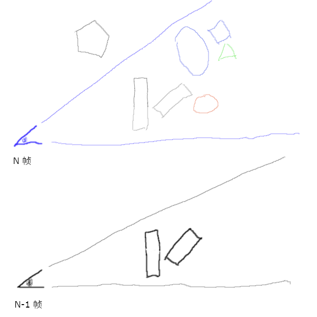

# hala-visibility-rendering
[](https://www.gnu.org/licenses/gpl-3.0.en.html)
[](https://blog.rust-lang.org/2023/06/01/Rust-1.70.0.html)

[English](README.md) | [中文](README_CN.md) | [日本語](README_JP.md) | [한국어](README_KO.md)

## 서문

Visibility Buffer의 개념은 2013년으로 거슬러 올라갑니다. Christopher A. Burns와 Warren A. Hunt가 그들의 논문 [The Visibility Buffer: A Cache-Friendly Approach to Deferred Shading](https://jcgt.org/published/0002/02/04/)에서 처음으로 이 개념을 제안했습니다. 그 이후로 10년이 넘는 시간이 흘렀습니다. 이 기술은 복잡한 장면에서의 효율성 덕분에 점점 더 많은 관심과 응용을 받고 있습니다.

현재, 점점 더 많은 게임 엔진과 실제 게임 프로젝트가 GPU Driven과 Visibility Buffer 기술을 결합하여 렌더링 성능과 화질을 향상시키고 있습니다. 이 결합은 현대 그래픽 렌더링 기술이 장면의 복잡성과 대규모 데이터를 처리할 때 더 효율적으로 작동하게 하며, CPU의 부담을 줄이고 GPU의 계산 능력을 최대한 활용할 수 있게 합니다. 본 프로젝트는 GPU Culling부터 시작하여 가장 기본적인 Visibility Rendering을 구현하고, 이후 모든 렌더링 단계를 추진하는 것을 목표로 합니다.


## 개발 환경 설정

현재 전체 개발 환경은 Windows 플랫폼에서 RTX 4090으로 테스트되었습니다 (제한된 장비로 인해 더 많은 호환성을 테스트할 수 없었습니다). `hala-gfx`, `hala-renderer` 및 `hala-imgui`를 기반으로 개발되었습니다.

* `hala-gfx`는 Vulkan 호출과 래핑을 담당합니다.
* `hala-renderer`는 glTF 파일에서 Mesh 정보를 읽고 GPU에 업로드하는 역할을 합니다.
* `hala-imgui`는 imGUI의 Rust 브리지로, 사용자 인터페이스의 표시와 상호작용을 담당합니다.

Rust 1.70+을 설치하고, 이미 설치된 경우 `rustup update`로 최신 버전으로 업데이트합니다. `git clone --recursive`를 사용하여 저장소와 서브모듈을 클론합니다. `cargo build`로 디버그 버전을 컴파일하고, `cargo build -r`로 릴리즈 버전을 컴파일합니다.

컴파일이 완료되면 바로 실행할 수 있습니다.

    ./target/（debug 또는 release）/hala-vis-renderer -c conf/config.toml

## 렌더링 프로세스

**주의: 아래 모든 코드는 코드 조각으로 직접 실행할 수 없습니다. 또한 설명을 위해 많은 Shader 코드가 일부 "가짜 코드"로 작성되어 있어 직접 컴파일할 수 없습니다.**

구체적인 소스 코드는 GitHub 저장소를 참조하십시오: [hala-visibility-rendering](https://github.com/zhing2006/hala-visibility-rendering).

### 데이터 준비

GPU Driven을 효율적으로 사용하기 위해, 먼저 모든 기하학 데이터(Mesh)를 [meshopt](https://crates.io/crates/meshopt) crate를 통해 Meshlet으로 변환합니다.

다음은 단일 Mesh를 처리하는 코드 조각입니다.
```rust
  let vertex_data_adapter = unsafe {
    meshopt::VertexDataAdapter::new(
      std::slice::from_raw_parts(vertices.as_ptr() as *const u8, vertices.len() * std::mem::size_of::<HalaVertex>()),
      std::mem::size_of::<HalaVertex>(),
      0,
    ).map_err(|err| HalaRendererError::new("Failed to create vertex data adapter.", Some(Box::new(err))))?
  };
  let meshlets = meshopt::clusterize::build_meshlets(
    indices.as_slice(),
    &vertex_data_adapter,
    64,   // 단일 Meshlet 최대 정점 수
    124,  // 단일 Meshlet 최대 삼각형 수
    0.5,  // Cone weight, 주로 후면 제거의 효율성에 영향을 미침
  );
  for (meshlet_index, meshlet) in meshlets.meshlets.iter().enumerate() {
    let wrapped_meshlet = meshlets.get(meshlet_index);
    let bounds = meshopt::clusterize::compute_meshlet_bounds(
      wrapped_meshlet,
      &vertex_data_adapter,
    );

    let hala_meshlet = HalaMeshlet {
      center: bounds.center,
      radius: bounds.radius,
      cone_apex: bounds.cone_apex,
      cone_axis: bounds.cone_axis,
      cone_cutoff: bounds.cone_cutoff,
      offset_of_vertices: meshlet_vertices.len() as u32,
      num_of_vertices: meshlet.vertex_count,
      offset_of_primitives: meshlet_primitives.len() as u32,
      num_of_primitives: (wrapped_meshlet.triangles.len() / 3) as u32,
      draw_index, // 이 Meshlet의 Draw Index를 저장, 여기서는 간단히 처리. 실제 환경에서는 CPU 정렬 후 실제 Meshlet 렌더링 큐의 인덱스를 사용해야 함
    };

    for i in wrapped_meshlet.vertices.iter() {
      meshlet_vertices.push(*i);
    }
    for c in wrapped_meshlet.triangles.chunks(3) {
      // Meshlet 최대 정점 수는 64이므로, 각 삼각형의 정점 인덱스는 8비트로 충분히 저장 가능
      meshlet_primitives.push((c[0] as u32) | (c[1] as u32) << 8 | (c[2] as u32) << 16);
    }
  }
```

위에서 언급한 `draw_index`를 기억하시나요? 이제 이를 사용하여 DrawData 데이터를 준비합니다.

```rust
struct DrawData {
  pub object_index: u32,
  pub material_index: u32,
}

draw_data.push(DrawData {
  object_index: mesh.index,
  material_index: prim.material_index,
});
```
object_index는 Object의 관련 정보를 인덱싱하는 데 사용되며, 예를 들어 Transform 등입니다. material_index는 이 draw에 사용되는 재료 정보를 인덱싱하여 Alpha Test와 셰이딩에 사용됩니다.

전체 장면의 Camera 데이터, Light 데이터, DrawData 데이터 및 Meshlet 데이터를 바인딩합니다.
```rust
hala_gfx::HalaDescriptorSetLayout::new(
  Rc::clone(&logical_device),
  &[
    // 글로벌 uniform buffer, 글로벌 정보 저장, 예: vp 행렬, 역 vp 행렬 등.
    hala_gfx::HalaDescriptorSetLayoutBinding {
      binding_index: 0,
      descriptor_type: hala_gfx::HalaDescriptorType::UNIFORM_BUFFER,
      ...
    },
    // 카메라 uniform buffer, 장면의 카메라 정보 저장, 예: 각 카메라의 위치 등.
    hala_gfx::HalaDescriptorSetLayoutBinding {
      binding_index: 1,
      descriptor_type: hala_gfx::HalaDescriptorType::UNIFORM_BUFFER,
      ...
    },
    // 조명 uniform buffer, 장면의 조명 정보 저장, 예: 각 조명의 위치 등.
    hala_gfx::HalaDescriptorSetLayoutBinding {
      binding_index: 2,
      descriptor_type: hala_gfx::HalaDescriptorType::UNIFORM_BUFFER,
      ...
    },
    // 위에서 언급한 DrawData 정보의 storage buffer.
    hala_gfx::HalaDescriptorSetLayoutBinding {
      binding_index: 3,
      descriptor_type: hala_gfx::HalaDescriptorType::STORAGE_BUFFER,
      ...
    },
    // Meshlet 정보의 storage buffer.
    hala_gfx::HalaDescriptorSetLayoutBinding {
      binding_index: 4,
      descriptor_type: hala_gfx::HalaDescriptorType::STORAGE_BUFFER,
      ...
    },
  ],
  "main_static.descriptor_set_layout",
)?,
```

Bindless를 사용하여 Material 데이터, Object 데이터, Mesh 데이터 및 Meshlet 데이터를 바인딩합니다.
```rust
hala_gfx::HalaDescriptorSetLayout::new(
  Rc::clone(&logical_device),
  &[
    // Material 정보 저장하는 uniform buffer 배열.
    hala_gfx::HalaDescriptorSetLayoutBinding {
      binding_index: 0,
      descriptor_type: hala_gfx::HalaDescriptorType::UNIFORM_BUFFER,
      descriptor_count: scene.materials.len() as u32,
      ...
    },
    // Object 정보 저장하는 uniform buffer 배열.
    hala_gfx::HalaDescriptorSetLayoutBinding {
      binding_index: 1,
      descriptor_type: hala_gfx::HalaDescriptorType::UNIFORM_BUFFER,
      descriptor_count: scene.meshes.len() as u32,
      ...
    },
    // 각 Mesh의 정점 정보, storage buffer 배열.
    hala_gfx::HalaDescriptorSetLayoutBinding {
      binding_index: 2,
      descriptor_type: hala_gfx::HalaDescriptorType::STORAGE_BUFFER,
      descriptor_count: vertex_buffers.len() as u32,
      ...
    },
    // 각 Meshlet의 정점 정보, storage buffer 배열.
    hala_gfx::HalaDescriptorSetLayoutBinding {
      binding_index: 3,
      descriptor_type: hala_gfx::HalaDescriptorType::STORAGE_BUFFER,
      descriptor_count: meshlet_vertex_buffers.len() as u32,
      ...
    },
    // 각 Meshlet의 삼각형 정보, storage buffer 배열.
    hala_gfx::HalaDescriptorSetLayoutBinding {
      binding_index: 4,
      descriptor_type: hala_gfx::HalaDescriptorType::STORAGE_BUFFER,
      descriptor_count: meshlet_primitive_buffers.len() as u32,
      ...
    },
  ],
  "main_dynamic.descriptor_set_layout",
)?,
```

마지막으로 Bindless를 사용하여 Texture 데이터를 바인딩합니다.
```rust
  hala_gfx::HalaDescriptorSetLayout::new(
    Rc::clone(&logical_device),
    &[
      // 모든 텍스처의 Image 배열.
      hala_gfx::HalaDescriptorSetLayoutBinding {
        binding_index: 0,
        descriptor_type: hala_gfx::HalaDescriptorType::SAMPLED_IMAGE,
        descriptor_count: scene.textures.len() as u32,
        ...
      },
      // 모든 텍스처 샘플러의 Sampler 배열.
      hala_gfx::HalaDescriptorSetLayoutBinding { // All samplers in the scene.
        binding_index: 1,
        descriptor_type: hala_gfx::HalaDescriptorType::SAMPLER,
        descriptor_count: scene.textures.len() as u32,
        ...
      },
    ],
    "textures.descriptor_set_layout",
  )?,
```

이로써 모든 데이터가 준비되었습니다. 이제 GPU 렌더링을 시작할 차례입니다. 우리는 한 번의 TaskDraw로 전체 장면을 그립니다.
```rust
// 각 Task 스레드 그룹은 32개의 스레드를 가집니다.
let dispatch_size_x = (scene.meshlet_count + 32 - 1) / 32;
graphics_command_buffers.draw_mesh_tasks(
  index,
  dispatch_size_x,
  1,
  1,
);
```

### GPU 클리핑

먼저 백페이스 클리핑과 뷰 프러스텀 클리핑을 수행해야 합니다. 여기서는 이전에 메슐렛(Meshlet)을 계산할 때 생성된 콘(Cone)과 스피어(Sphere) 데이터를 사용합니다.
```rust
  // 백페이스 클리핑.
  const float3 cone_apex = mul(per_object_data.m_mtx, float4(meshlet.cone_apex, 1.0)).xyz;
  const float3 cone_axis = normalize(mul(float4(meshlet.cone_axis, 0.0), per_object_data.i_m_mtx).xyz);
  if (dot(normalize(cone_apex - camera_position), cone_axis) >= meshlet.cone_cutoff) {
    is_visible = false;
  }

  if (is_visible) {
    // 뷰 프러스텀 클리핑, 객체가 비등비 스케일링을 가지므로 여기서는 바운드 스피어 클리핑을 직접 사용하지 않고 바운드 박스로 변환하여 수행합니다.
    const float3 bound_box_min = mul(per_object_data.m_mtx, float4(meshlet.bound_sphere.xyz - meshlet.bound_sphere.w, 1.0)).xyz;
    const float3 bound_box_max = mul(per_object_data.m_mtx, float4(meshlet.bound_sphere.xyz + meshlet.bound_sphere.w, 1.0)).xyz;
    if (is_box_frustum_culled(bound_box_min, bound_box_max)) {
      is_visible = false;
    }
  }
```

다음으로는 오클루전 컬링을 수행합니다. 여기서는 2-Phase Occlusion Culling을 사용합니다.



현재 프레임(N 프레임) 이전에 회색으로 표시된 이전 프레임(N-1 프레임)이 있다고 가정합니다. N-1 프레임에서 두 개의 상자를 렌더링했습니다. 이 깊이 버퍼는 N 프레임에서 계속 사용됩니다.

N 프레임에서는 먼저 뷰 프러스텀 클리핑과 백페이스 클리핑을 완료합니다. 이 단계에서 시야 범위 밖의 다각형이 클리핑됩니다.

다음으로, 이전 프레임의 깊이 버퍼를 사용하여 파란색 타원과 사각형이 렌더링됩니다. 타원은 상관없지만, 그 뒤에 가려진 사각형도 렌더링됩니다. 이 상황에서 렌더링되지 말아야 할 객체가 렌더링되는 것을 False Positive(거짓 양성)이라고 합니다. 그러나, 다음 프레임에서 카메라가 크게 이동하지 않는 한, False Positive는 일반적으로 오래 지속되지 않습니다.

오렌지색 구체와 연한 녹색 삼각형은 첫 번째 단계에서 이전 프레임의 깊이 버퍼에 의해 클리핑됩니다. 첫 번째 단계에서 오클루전 클리핑된 모든 객체는 False Negative로 표시되므로 일시적으로 렌더링되지 않습니다.

두 번째 단계의 클리핑 전에, 첫 번째 단계에서 클리핑되지 않은 타원과 사각형이 깊이 버퍼에 렌더링됩니다. 두 번째 단계에서는 이 깊이 버퍼를 사용하여 클리핑을 수행합니다. 첫 번째 단계에서 클리핑된 오렌지색 구체는 이 깊이 버퍼에서 클리핑되지 않으므로 렌더링됩니다. 이는 False Negative임을 증명합니다. 그러나, 연한 녹색 삼각형은 이번에도 타원에 의해 가려져 클리핑되므로 False Negative가 아니며 실제로 클리핑되어야 합니다.

구체적인 구현은 다음 코드를 참조하십시오.

Pass One
```HLSL
float3 aabb_min_screen, aabb_max_screen;
// 화면 공간의 AABB를 계산합니다. 박스가 카메라의 전방 클리핑 평면과 교차하면 to_screen_aabb는 true를 반환하여 오클루전 클리핑이 필요하지 않습니다.
if (!to_screen_aabb(g_global_uniform.vp_mtx, bound_box_min, bound_box_max, aabb_min_screen, aabb_max_screen)) {
  // 오클루전된 경우, 오클루전 및 가시성 정보를 기록합니다.
  if (is_occluded(in_hiz_image, g_push_constants.hiz_levels, g_push_constants.hiz_size, aabb_min_screen, aabb_max_screen)) {
    is_occluded_by_hiz = true;
    is_visible = false;
  }
}

// 가시성(참 양성)이 있고 오클루전되지 않은 경우(거짓 양성), 이 Pass는 렌더링된 것으로 표시되어 Pass Two는 표시되지 않은 Meshlet만 처리합니다.
out_culling_flags.Store(meshlet_index * 4, (is_visible || !is_occluded_by_hiz) ? 1 : 0);
```

Pass Two
```HLSL
const uint culling_flag = in_culling_flags.Load(meshlet_index * 4);
// Pass One에서 이 Meshlet이 렌더링되지 않은 경우, 오클루전 클리핑 판단을 시작합니다.
if (culling_flag == 0) {
  const float3 bound_box_min = mul(per_object_data.m_mtx, float4(meshlet.bound_sphere.xyz - meshlet.bound_sphere.w, 1.0)).xyz;
  const float3 bound_box_max = mul(per_object_data.m_mtx, float4(meshlet.bound_sphere.xyz + meshlet.bound_sphere.w, 1.0)).xyz;

  // 이전 단계와 동일, 설명 생략.
  float3 aabb_min_screen, aabb_max_screen;
  if (!to_screen_aabb(g_global_uniform.vp_mtx, bound_box_min, bound_box_max, aabb_min_screen, aabb_max_screen)) {
    if (is_occluded(in_hiz_image, g_push_constants.hiz_levels, g_push_constants.hiz_size, aabb_min_screen, aabb_max_screen)) {
      is_visible = false;
    } else {
      is_visible = true;
    }
  }
}

Pass One과 Pass Two 모두 Wave 함수를 사용하여 가시 Meshlet 수를 집계한 후, 해당 수만큼 Mesh Shader 호출을 발행합니다.
```HLSL
if (is_visible) {
  const uint index = WavePrefixCountBits(is_visible);
  ms_payload.meshlet_indices[index] = meshlet_index;
}

// 하나의 Meshlet이 하나의 Mesh Shader Group을 발행합니다.
const uint visible_count = WaveActiveCountBits(is_visible);
DispatchMesh(visible_count, 1, 1);
```

이 방법의 주요 장점은 Occluder와 Occludee를 구분할 필요가 없다는 것입니다. 이전 프레임의 깊이 버퍼가 직접 Occluder로 사용되며, 현재 프레임에서 렌더링할 모든 객체가 Occludee로 처리됩니다. 따라서, 더 이상 간단한 Occluder 전용 메쉬가 필요하지 않습니다.

또한, 두 번째 단계가 완료된 후에는 렌더링되어야 할 객체가 클리핑되어 사라지는 현상(False Negative)이 발생하지 않습니다. 이는 UE4에서 흔히 볼 수 있는 객체가 잠시 사라지는 현상을 완전히 제거합니다.

그러나, 클리핑되어야 할 객체가 클리핑되지 않는 현상(False Positive)도 발생할 수 있습니다. CPU나 GPU에서 처리하든, 바운딩 박스를 사용하여 오클루전 검사를 수행하는 한 False Positive는 피할 수 없습니다. 그러나 이 방법에서는 바운딩 박스가 완전히 가려져도 False Positive가 발생할 수 있습니다. 하지만, 앞서 언급했듯이 False Positive로 렌더링된 객체는 연속된 프레임에서 여러 번 나타나기 어렵습니다. 예를 들어, N+1 프레임과 N 프레임의 카메라 위치가 동일하다면, 이전 프레임의 깊이 버퍼는 이미 타원을 렌더링했으므로, 두 단계 모두에서 사각형이 가려져 렌더링되지 않습니다.

이 방법은 많은 장점이 있지만, 단점도 있습니다. 클리핑 처리가 두 번 수행된다는 것입니다. 뷰 프러스텀 클리핑과 백페이스 클리핑은 한 번만 수행되지만, 시간이 많이 걸리는 오클루전 클리핑은 최대 두 번 수행되므로 부담이 큽니다.

깊이 버퍼를 사용하여 클리핑할 때, 전체 해상도 깊이 버퍼를 사용하면 부담이 증가하므로 계층 깊이(HiZ)를 생성해야 합니다. 또한, 각 단계가 완료된 후 전체 장면을 두 번 수행해야 합니다. 깊이 버퍼가 쓰기에서 읽기 상태로 전환될 때, 깊이 버퍼의 압축 해제와 캐시 플러시가 동반되므로 계산량이 무시할 수 없습니다.

### 렌더링 가시성 ID

Mesh Shader를 사용한 후, 가시성 ID를 렌더링하는 것은 상대적으로 간단합니다. SV_PrimitiveID 데이터를 작성하기만 하면 됩니다.

```HLSL
struct ToFragmentPrimitive {
  uint primitive_id: SV_PrimitiveID;
};

primitives[triangle_id].primitive_id = pack_meshlet_triangle_index(meshlet_index, triangle_id);
```

우리의 Meshlet은 최대 124개의 삼각형을 처리할 수 있으므로 triangle_id는 7비트만 필요하고, meshlet_index는 25비트를 저장할 수 있습니다. 가시성 ID를 패킹하고 언패킹하는 함수는 다음과 같습니다.

```HLSL
uint pack_meshlet_triangle_index(uint meshlet_index, uint triangle_index) {
  return ((meshlet_index & 0x1FFFFFF) << 7) | (triangle_index & 0x7F);
}

void unpack_meshlet_triangle_index(uint packed_index, out uint meshlet_index, out uint triangle_index) {
  meshlet_index = (packed_index & 0xFFFFFF80) >> 7;
  triangle_index = packed_index & 0x7F;
}
```

최종 가시성 버퍼 내용은 다음과 같습니다.


### 재질 분류 정렬

다음 드로잉을 위해, 여기서는 각 유형의 재질에 대해 IndirectDraw 매개변수를 생성하고 64x64 타일 크기로 드로잉을 수행해야 합니다.

여기서는 UE5 방법을 사용하여 먼저 다른 유형의 재질을 Depth Buffer에 기록합니다.

```HLSL
const uint vis_id = in_vis_buffer[screen_xy];
uint meshlet_index, triangle_id;
unpack_meshlet_triangle_index(vis_id, meshlet_index, triangle_id);

const Meshlet meshlet = g_global_meshlets[meshlet_index];
const DrawData draw_data = g_draw_data[meshlet.draw_index];
output.depth = (float)draw_data.material_index / (float)CLASSIFY_DEPTH_RANGE;
```

CLASSIFY_DEPTH_RANGE는 모든 재질 유형을 수용할 수 있는 상수입니다.

다음으로 Compute Shader를 사용하여 재질을 분류합니다. 먼저 분류 함수를 보겠습니다.

```HLSL
// CLASSIFY_DEPTH_RANGE = CLASSIFY_NUM_OF_MATERIALS_PER_GROUP * 32
// 하나의 uint는 32비트이므로, 여기서는 그룹 내 공유 메모리의 길이가 CLASSIFY_NUM_OF_MATERIALS_PER_GROUP인 재질 정보를 저장해야 합니다.
groupshared uint gs_material_flag[CLASSIFY_NUM_OF_MATERIALS_PER_GROUP];

void classify_pixel(in uint2 pos) {
  if (all(lessThan(pos, g_push_constants.screen_size))) {
    const float depth = in_depth_buffer.Load(pos, 0);

    // 이 픽셀이 유효하며, 무한대(배경)에 있지 않습니다.
    if (depth > 0.0) {
      const uint vis_id = in_vis_buffer.Load(pos, 0);
      uint meshlet_index, triangle_id;
      unpack_meshlet_triangle_index(id, meshlet_index, triangle_id);

      const Meshlet meshlet = g_global_meshlets[meshlet_index];
      const DrawData draw_data = g_draw_data[meshlet.draw_index];
      const uint material_index = draw_data.material_index;
      const uint index = draw_data.material_index / 32;
      const uint bit = draw_data.material_index % 32;
      uint orig;
      // 이 위치의 재질 유형을 그룹 내 공유 메모리에 표시합니다.
      InterlockedOr(gs_material_flag[index], 0x1u << bit, orig);
    }
  }
}
```

전체 분류 과정은 다음과 같습니다.

```HLSL
[numthreads(CLASSIFY_THREAD_WIDTH, CLASSIFY_THREAD_WIDTH, 1)]
void main(
  uint3 group_id : SV_GroupID,
  uint3 group_thread_id : SV_GroupThreadID,
  uint3 dispatch_thread_id : SV_DispatchThreadID)
{
  // 그룹 내 공유 메모리를 초기화합니다.
  const uint mat_chunk_index = group_thread_id.y * CLASSIFY_THREAD_WIDTH + group_thread_id.x;
  gs_material_flag[mat_chunk_index] = 0x0;

  // 그룹 내 동기화.
  GroupMemoryBarrierWithGroupSync();

  // 64x64 범위 내의 픽셀에 대해 재질 분류를 수행합니다.
  const uint2 base_pos = group_id.xy * CLASSIFY_TILE_WIDTH + group_thread_id.xy;
  for (uint x = 0; x < 4; x++) {
    for (uint y = 0; y < 4; y++) {
      classify_pixel(base_pos + uint2(x, y) * CLASSIFY_THREAD_WIDTH);
    }
  }

  // 그룹 내 동기화.
  GroupMemoryBarrierWithGroupSync();

  // 분류 정보를 읽고 IndirectDraw 데이터를 생성합니다.
  uint bits = gs_material_flag[mat_chunk_index];
  if (bits != 0) {
    const uint mat_base_index = mat_chunk_index * 32;
    while (bits != 0) {
      const uint first_bit = firstbitlow(bits);
      const uint mat_index = mat_base_index + first_bit;
      bits &= ~(0x1u << first_bit);

      // 하나의 IndirectDrawArgs 크기는 16바이트입니다 (vertex_count, instance_count, first_vertex, first_instance).
      const uint arg_addr = mat_index * 16;
      uint store_addr = 0;
      // instance_count 필드를 1 증가시켜 이 64x64 타일이 드로잉되어야 함을 표시합니다.
      InterlockedAdd(out_indirect_draw_arguments, arg_addr + 4, 1, store_addr);

      // 이 타일의 인덱스를 기록하여 나중에 드로잉 시 해당 사각형을 생성합니다.
      const uint tile_no = group_id.y * g_push_constants.x_size + group_id.x;
      store_addr = ((mat_index * g_push_constants.num_of_tiles) + store_addr) * 4;
      out_tile_index.Store(store_addr, tile_no);
    }
  }
}
```

이제 Material Depth를 사용하여 각 유형의 재질에 대해 IndirectDraw를 호출할 수 있습니다. 이때 Z-Test Equal을 사용하여 재질이 덮인 픽셀만 드로잉합니다.

```rust
for material_index in 0..num_of_materials {
  graphics_command_buffers.draw_indirect(
    index,
    self.indirect_draw_buffer.as_ref(),
    material_index as u64 * std::mem::size_of::<hala_gfx::HalaIndirectDrawCommand>() as u64,
    1,
    std::mem::size_of::<hala_gfx::HalaIndirectDrawCommand>() as u32,
  );
}
```

여기서는 간단하게 하기 위해 재질 수를 재질 유형으로 사용했지만, 실제 사용 시에는 재질 유형을 사용해야 합니다.

### GBuffer 렌더링

비저빌리티 렌더링(Visibility Rendering)에서는 GBuffer가 필수는 아니지만, 현재 게임 렌더링이 점점 복잡해지고 있기 때문에 삼각형 기하 데이터와 재질 데이터를 반복적으로 가져오는 것을 피하기 위해, 특히 비저빌리티 렌더링에서 편미분을 수동으로 계산해야 하기 때문에, 여기서는 여전히 GBuffer 렌더링을 통해 기하학 단계와 조명 단계를 분리합니다.

먼저 비저빌리티 버퍼에서 기하 정보를 복원해야 합니다.

```HLSL
// Meshlet 데이터를 통해 삼각형의 세 꼭지점 인덱스를 가져옵니다.
uint3 load_primitive_index(uint index, uint draw_index) {
  const uint primitive_index = g_unique_primitives[draw_index].Load(index * 4);

  const uint triangle_index0 = (primitive_index & 0xFF);
  const uint triangle_index1 = (primitive_index & 0xFF00) >> 8;
  const uint triangle_index2 = (primitive_index & 0xFF0000) >> 16;
  return uint3(triangle_index0, triangle_index1, triangle_index2);
}

const uint vis_id = in_vis_buffer[screen_xy];
uint meshlet_index, triangle_id;
unpack_meshlet_triangle_index(vis_id, meshlet_index, triangle_id);

const Meshlet meshlet = g_global_meshlets[meshlet_index];
uint triangle_index = meshlet.offset_of_primitives + triangle_id;
const uint3 tri = load_primitive_index(triangle_index, meshlet.draw_index);
```

질점과 편미분을 계산할 때는 http://filmicworlds.com/blog/visibility-buffer-rendering-with-material-graphs/ 의 방법을 사용합니다.
```HLSL
struct BaryDeriv {
  float3 lambda;
  float3 ddx;
  float3 ddy;
};

BaryDeriv calc_full_bary(float4 pt0, float4 pt1, float4 pt2, float2 pixel_ndc, float2 win_size) {
  BaryDeriv ret = (BaryDeriv)0;

  const float3 inv_w = rcp(float3(pt0.w, pt1.w, pt2.w));

  const float2 ndc0 = pt0.xy * inv_w.x;
  const float2 ndc1 = pt1.xy * inv_w.y;
  const float2 ndc2 = pt2.xy * inv_w.z;

  const float inv_det = rcp(determinant(float2x2(ndc2 - ndc1, ndc0 - ndc1)));
  ret.ddx = float3(ndc1.y - ndc2.y, ndc2.y - ndc0.y, ndc0.y - ndc1.y) * inv_det * inv_w;
  ret.ddy = float3(ndc2.x - ndc1.x, ndc0.x - ndc2.x, ndc1.x - ndc0.x) * inv_det * inv_w;
  float ddx_sum = dot(ret.ddx, float3(1, 1, 1));
  float ddy_sum = dot(ret.ddy, float3(1, 1, 1));

  const float2 delta_vec = pixel_ndc - ndc0;
  const float interp_inv_w = inv_w.x + delta_vec.x * ddx_sum + delta_vec.y * ddy_sum;
  const float interp_w = rcp(interp_inv_w);

  ret.lambda.x = interp_w * (inv_w[0] + delta_vec.x * ret.ddx.x + delta_vec.y * ret.ddy.x);
  ret.lambda.y = interp_w * (0.0      + delta_vec.x * ret.ddx.y + delta_vec.y * ret.ddy.y);
  ret.lambda.z = interp_w * (0.0      + delta_vec.x * ret.ddx.z + delta_vec.y * ret.ddy.z);

  ret.ddx *= (2.0 / win_size.x);
  ret.ddy *= (2.0 / win_size.y);
  ddx_sum *= (2.0 / win_size.x);
  ddy_sum *= (2.0 / win_size.y);

  ret.ddy *= -1.0;
  ddy_sum *= -1.0;

  const float interp_w_ddx = 1.0 / (interp_inv_w + ddx_sum);
  const float interp_w_ddy = 1.0 / (interp_inv_w + ddy_sum);

  ret.ddx = interp_w_ddx * (ret.lambda * interp_inv_w + ret.ddx) - ret.lambda;
  ret.ddy = interp_w_ddy * (ret.lambda * interp_inv_w + ret.ddy) - ret.lambda;

  return ret;
}

float3 interpolate_with_deriv(BaryDeriv deriv, float v0, float v1, float v2) {
  const float3 merged_v = float3(v0, v1, v2);
  float3 ret;
  ret.x = dot(merged_v, deriv.lambda);
  ret.y = dot(merged_v, deriv.ddx);
  ret.z = dot(merged_v, deriv.ddy);
  return ret;
}
```

구체적인 정점 데이터를 가져오는 과정은 길기 때문에 생략하고, 가져온 정점 데이터만 나열합니다.

```HLSL
struct VertexAttributes {
  float3 position;
  float3 position_ddx;
  float3 position_ddy;
  float3 normal;
  float3 tangent;
  float2 texcoord;
  float2 texcoord_ddx;
  float2 texcoord_ddy;
};
```

마지막으로 GBuffer에 쓰기만 하면 됩니다.

```HLSL
if (mtrl.base_color_map_index != INVALID_INDEX) {
  float3 base_color = SAMPLE_TEXTURE_GRAD(
    g_textures[mtrl.base_color_map_index],
    g_samplers[mtrl.base_color_map_index],
    vertex_attributes.texcoord,
    vertex_attributes.texcoord_ddx,
    vertex_attributes.texcoord_ddy
  ).rgb;
  output.albedo = float4(base_color, 1.0);
} else {
  output.albedo = float4(mtrl.base_color, 1.0);
}

output.normal = float4(vertex_attributes.normal * 0.5 + 0.5, 1.0);
```

이로써 우리는 완전한 GBuffer 데이터를 얻었습니다.


### 세계를 밝히다

사실 이 단계에서는 더 이상 설명할 것이 없습니다. 우리는 이미 Albedo, Normal, Depth를 가지고 있으며, 남은 것은 세계 공간에서 다양한 속성을 복원하여 조명을 계산하는 것입니다. 관련된 소개 글이 많이 있으므로 여기서는 반복하지 않겠습니다.


## 감사의 말

이 프로젝트의 개발은 Monsho의 https://github.com/Monsho/VisibilityBuffer 에서 많은 영감을 받았습니다. 많은 지식을 배울 수 있었으며, 깊이 감사드립니다.